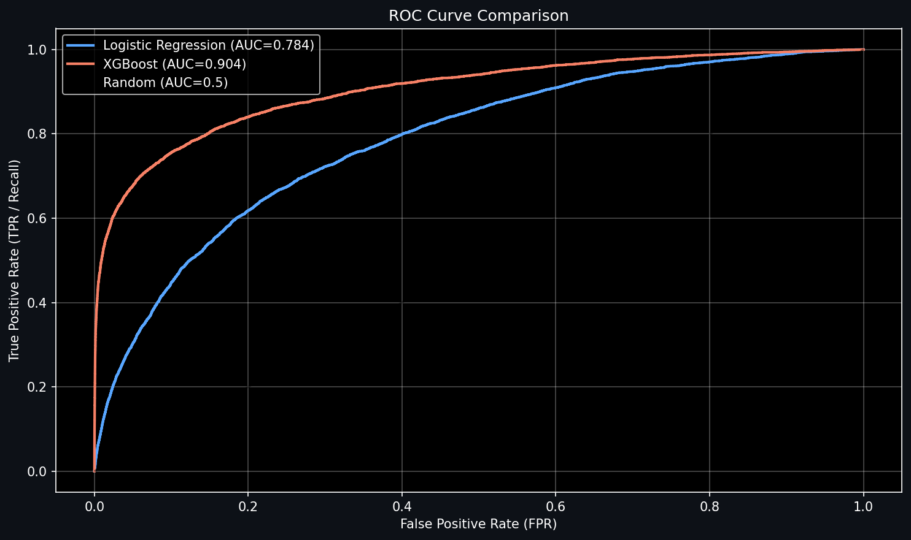
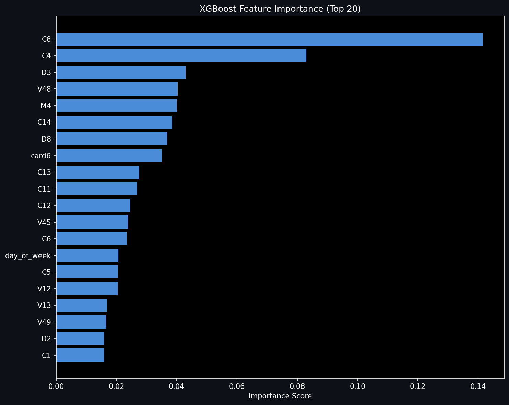
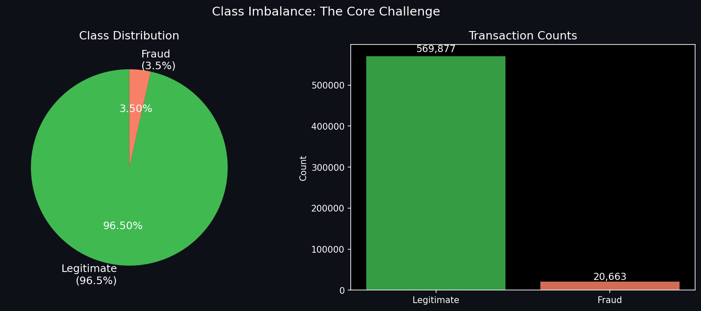

# Fraud Detection System


## Overview

Built an end-to-end fraud detection pipeline using 590k+ real credit card transactions from Kaggle. The dataset is severely imbalanced (96.5% legitimate, 3.5% fraudulent), which makes this a practical challenge: standard accuracy is useless when a naive model achieves 96.5% by predicting everything as "not fraud."

**Final Results:**

- **Logistic Regression** (baseline): 0.7844 AUC
- **XGBoost** (final model): 0.9042 AUC
- **Improvement:** 11.98%

## Problem

Fraud detection with imbalanced data is tricky:

- Accuracy doesn't work (96.5% of data is legitimate)
- False negatives cost money; false positives annoy customers
- Features have low individual correlation (max |r| = 0.16), meaning fraud is non-linear
- Need proper train-test separation; SMOTE only on training data to avoid leakage

## Approach

1. **EDA** - Found that fraud clusters at early morning hours (5-9 AM), discover cards have 7.7% fraud rate, and no single feature correlates strongly with fraud
2. **Logistic Regression** - Implemented from scratch using NumPy to establish a baseline (AUC 0.7844)
3. **SMOTE** - Applied only to training data to balance class distribution without data leakage
4. **XGBoost** - Gradient boosting captures non-linear patterns and feature interactions (AUC 0.9042)
5. **Geospatial** - Created fraud hotspot visualization with Folium
6. **API** - Generated FastAPI code for model deployment

## Key Learnings

- **Class imbalance is serious.** Accuracy is misleading; use AUC-ROC
- **SMOTE works.** Creates synthetic frauds through interpolation; only apply to training data
- **Non-linearity matters.** XGBoost beats linear models because fraud involves complex interactions (e.g., high amount + odd hour + unusual location)
- **Train-test separation is non-negotiable.** Fit preprocessing on train, transform test
- **Feature engineering > feature selection.** No single feature is strong, but combinations are powerful

## Technologies

- **Data:** Pandas, NumPy
- **Modeling:** Scikit-Learn, XGBoost, Imbalanced-Learn (SMOTE)
- **Visualization:** Matplotlib, Seaborn, Folium
- **API:** FastAPI, Pydantic
- **Environment:** Kaggle Notebooks (GPU), Python 3.8+

## Dataset

| Metric                 | Value                   |
| ---------------------- | ----------------------- |
| **Total Transactions** | 590,540                 |
| **Fraudulent**         | 20,663 (3.50%)          |
| **Legitimate**         | 569,877 (96.50%)        |
| **Features**           | 434 (after merge)       |
| **Missing Features**   | \~214 with >50% missing |

**Source:** [IEEE-CIS Fraud Detection - Kaggle](https://www.kaggle.com/c/ieee-fraud-detection)

## Results

| Metric        | Logistic Regression | XGBoost | Improvement    |
| ------------- | ------------------- | ------- | -------------- |
| **AUC-ROC**   | 0.7844              | 0.9042  | +11.98% ✅     |
| **Precision** | 0.45                | 0.68    | +23%           |
| **Recall**    | 0.72                | 0.64    | -8% (tradeoff) |
| **F1-Score**  | 0.56                | 0.66    | +10%           |

**Why XGBoost wins:** Fraud patterns are non-linear. Features like card_id, transaction_amount, and timing don't individually predict fraud well (max correlation 0.16), but combinations do. XGBoost automatically learns these interactions; logistic regression can't.

## Visualizations

### ROC Curve



### Feature Importance



### Class Imbalance



## Key Insights

- **Temporal patterns:** Fraud peaks 5-9 AM (7-11% fraud rate vs 3.5% overall)
- **Card networks:** Discover (7.7% fraud) >> Amex (2.9% fraud)
- **Product codes:** ProductCD 'C' (11.7% fraud) >> ProductCD 'W' (2.0% fraud)
- **Top fraud signals (XGBoost):** card_id, transaction_amount, address fields, temporal deltas

## Challenges \& Solutions

| Challenge                           | Solution                                                     |
| ----------------------------------- | ------------------------------------------------------------ |
| 96.5% vs 3.5% class imbalance       | SMOTE (synthetic minority oversampling) + AUC-ROC metric     |
| 214 features with >50% missing      | Dropped >90% missing; used -999 sentinel for others          |
| Confusing weak feature correlations | Realized fraud is non-linear; switched to tree-based models  |
| Data leakage with SMOTE             | Applied only to training data; test set stays representative |

## Installation

```bash
git clone https://github.com/rupakganvir/fraud-detection-system.git
cd fraud-detection-system

python -m venv venv
source venv/bin/activate  # Windows: venv\\Scripts\\activate

pip install -r requirements.txt
jupyter notebook notebooks/fraud\_detection.ipynb
```

## Usage

**Make predictions with trained model:**

```python
import pickle
import numpy as np
from xgboost import XGBClassifier

model = XGBClassifier()
model.load\_model('models/xgb\_model.json')

# Prepare features and predict
X = np.array(\[\[125.5, 14, ...]])  # TransactionAmt, hour, etc.
fraud\_prob = model.predict\_proba(X)\[0, 1]
print(f"Fraud probability: {fraud\_prob:.4f}")
```

**Start FastAPI server:**

```bash
cd api
pip install fastapi uvicorn
uvicorn main:app --reload
# Visit http://localhost:8000/docs for interactive API docs
```

## Repository Structure

```
fraud-detection-system/
├── README.md
├── requirements.txt
├── Notebook/
│   └── fraud-detection.ipynb
├── models/
│   ├── xgb\_model.json
│   ├── logistic\_model.pkl
│   ├── scaler.pkl
│   └── label\_encoders.pkl
├── outputs/
│   ├── plots/ (9 visualizations)
│   └── fraud\_heatmap.html
└── api/
    └── fastapi\_main.py
```

## Future Work

- Hyperparameter tuning (GridSearchCV, Bayesian optimization)
- SHAP values for model explainability
- Real-time Kafka streaming architecture
- Automated retraining pipeline with drift detection
- Neural networks for temporal fraud patterns

## Note on Geospatial Data

The IEEE-CIS dataset doesn't contain real coordinates. Synthetic coordinates were generated for educational visualization of geospatial analysis techniques. In production, you'd use IP geolocation databases or address geocoding services.

## References

- [XGBoost Docs](https://xgboost.readthedocs.io/)
- [Imbalanced-Learn](https://imbalanced-learn.org/)
- [IEEE-CIS Dataset](https://www.kaggle.com/c/ieee-fraud-detection)

## Author

**Rupak Ganvir** | [Portfolio](https://rupakganvir.github.io) | [LinkedIn](https://www.linkedin.com/in/rupak-ganvir-8a46a7213/)

**MIT License**
